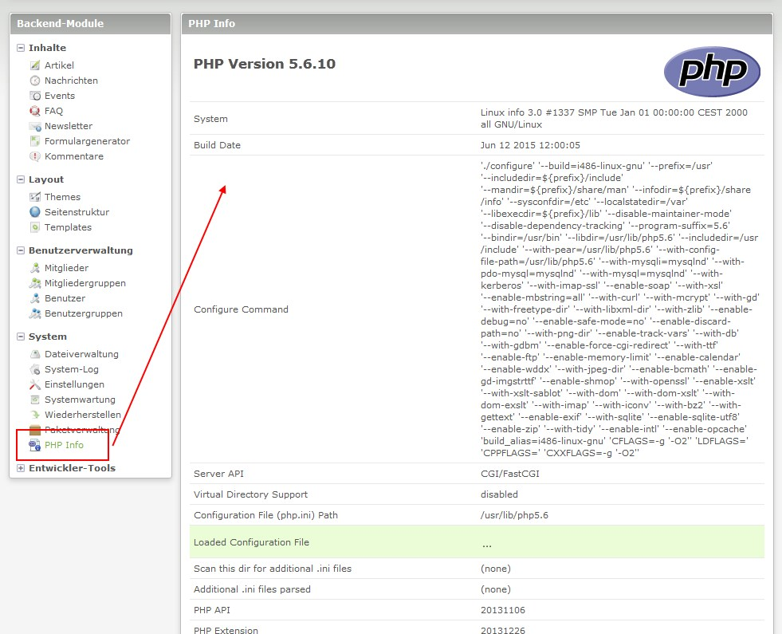

Contao Extension: php-info
==========================

Display `phpinfo` output in Contao backend.

Installation
------------

Install the extension via composer: [friends-of-contao/contao-php-info](https://packagist.org/packages/friends-of-contao/contao-php-info).

If you prefer to install it manually, download the latest release here: https://github.com/friends-of-contao/contao-php-info/releases

Tracker
-------

https://github.com/friends-of-contao/contao-php-info/issues

Compatibility
-------------

- min. Contao version: >= 3.2.0
- max. Contao version: <  3.6.0

Dependency
----------

- There are no dependencies to other extensions, that have to be installed.

Screenshots
-----------

